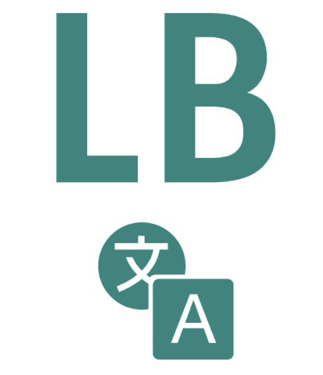
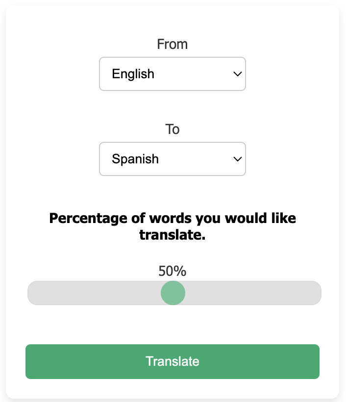

  
<h1> Chrome Extension for language learning. Pick a percentage of words you'd like to translate on the page.</h1>

<h5>
Select which language to you are translating from and which language you would like to translate to. Then s
</h5>

## Table of Contents
- [Usage](#usage)
  - [Setup](#setup) 
- [Tech Docs](#tech)
- [Credit](#credit)
- [Contributing](#contributing)

## Features 
- JavaScript (https://www.javascript.com/)
- [ESLint](https://eslint.org/)
- [Chrome Extension Manifest Version 3](https://developer.chrome.com/docs/extensions/mv3/intro/)

### Setup 
1. Clone this repository｀
3. Run `yarn` or `npm i`
4. Run `yarn build` or `npm run build`
5. Load Extension in Chrome
   1. Open - Chrome browser
   2. Access - chrome://extensions
   3. Tick - Developer mode
   4. Find - Load unpacked extension
   5. Select - `dist` folder in this project (after dev or build)
6. If you want to build in production, Just run `yarn build` or `npm run build`.

# Credit 
Jason Kopacz
https://jasonkopacz.com
